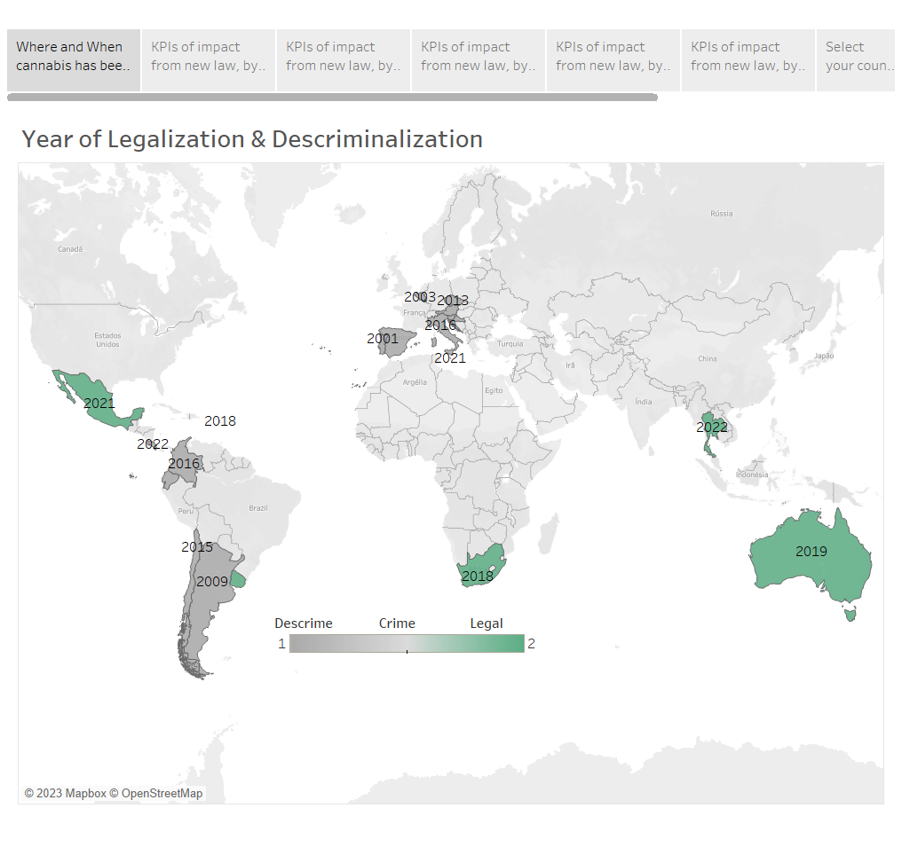

# Cannabis Legalization Effects Visualization
This project aims to analyze the effects of cannabis decriminalization/legalization on key performance indicators (KPIs) related to crime rates, prisoners, drug seizures, and addiction treatment. The data used for this analysis was sourced from multiple databases, transformed, and visualized using Tableau.

# Data Sources
The data for this analysis was obtained from various sources:

Web Scraping: Information on the legal status of cannabis decriminalization/legalization was scraped from a Wikipedia page.

UNODC Databases: Historical data on drug use treatment, intentional homicide victims, drug seizures, and prisoners held/entering prisons were extracted from UNODC databases.

# Visualization Process
      Data Extraction and Transformation: The extracted data was transformed and cleansed using Python libraries such as Pandas, Re, and Numpy. The data was standardized, duplicates and irrelevant information          were removed, and missing values were handled.

      Database Creation: The transformed data was stored in a MySQL database, with each KPI having its corresponding table.

      Tableau Import: The data from the MySQL database was exported as CSV files and imported into Tableau. Most tables were imported directly, but the "prison" table required additional formatting and 
      transformation. It was converted into two new tables using Google Sheets and saved as CSV files.

      Visualization Design: In Tableau, the relationships between the tables were established manually. The data was then visualized using various charts, graphs, and other visual elements to effectively      
      illustrate the trends and patterns.

      Analysis and Insights: The Tableau visualization enabled the analysis of the effects of cannabis policy changes on the selected KPIs. It allowed for comparisons between countries and years, identification        of trends, and highlighting noteworthy observations.

    Conclusion: Based on the analysis conducted in Tableau, it was determined that the legalization or decriminalization of cannabis has not shown a positive impact on crime rates and the number of people in         rehab treatment. In several cases, an increase in crime rates and rehab admissions was observed.

# Future Analysis Recommendations
To delve deeper into the analysis and gain further insights, the following recommendations are suggested:

Analyze the impact of cannabis policy changes by individual countries, particularly focusing on those with lower total populations and/or low crime indexes and drug addiction rates.

Compare the effects of different types of cannabis policies, such as full legalization versus decriminalization, to determine any variations in outcomes.

Consider the timeframe of cannabis policy changes, as most laws were passed between 2018 and 2019. Future data collection will provide a more comprehensive and up-to-date analysis.

Perform a detailed examination of the evolution of crime rates, rehab admission numbers, and other KPIs within each country to better isolate the influence of population size, crime rates, and addiction rates.

# Conclusion
This Tableau visualization project provides a first overview analysis of the effects of cannabis decriminalization/legalization on various KPIs related to crime rates, prisoners, drug seizures, and addiction treatment. It presents insights into the impact of cannabis policy changes on different countries and provides a foundation for further analysis and interpretation of the data.

